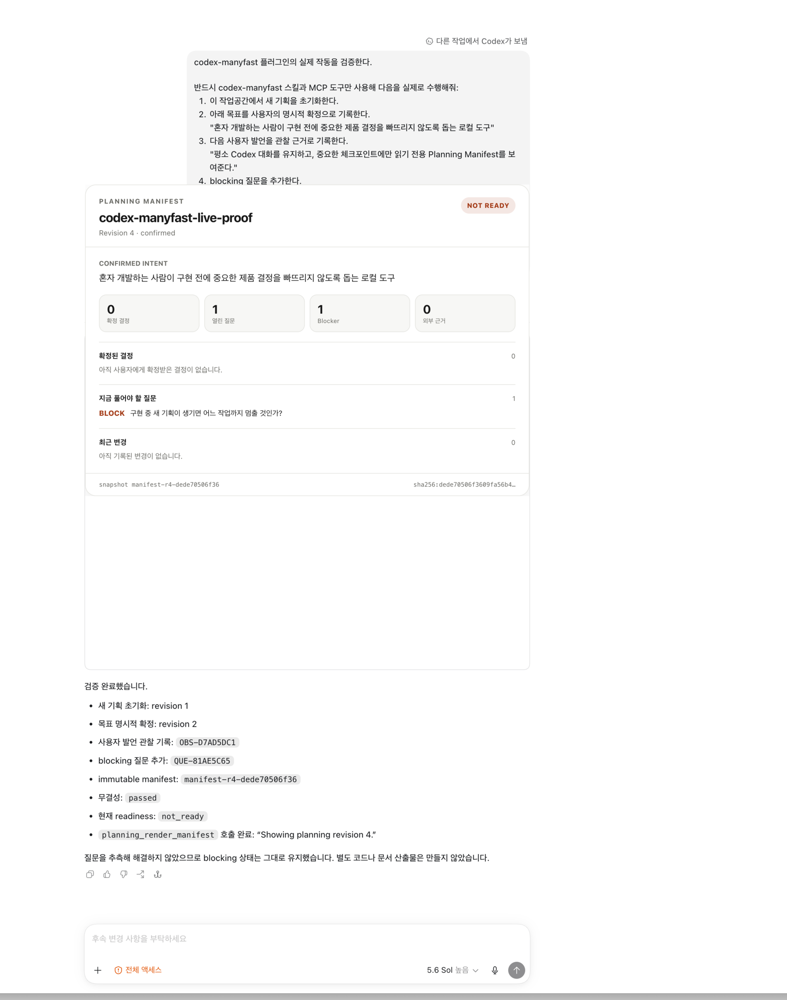

<div align="center">

# Codex Manyfast

**평소 Codex 대화를 유지하는 local-first 기획 연속성 플러그인**

[](./plugins/codex-manyfast/.codex-plugin/plugin.json)
[](./LICENSE)
[](./package.json)
[](#작동-방식)
[](#검증된-범위)

[English](./README.md) · [한국어](./README.ko.md) · [만든 이유](#만든-이유) · [빠른 시작](#빠른-시작) · [실행 화면](#실행-화면) · [아키텍처](#아키텍처)

</div>

AI 코딩 에이전트는 그럴듯한 기획을 만들면서도 가장 중요한 빈칸을 조용히 채울 수 있습니다. 사용자가 누구인지, 어떤 근거가 있는지, 사용자가 어느 trade-off를 받아들였는지, 구현 중 생긴 요구가 기존 결정을 무효화하는지가 대표적입니다.

**Codex Manyfast**는 평소 Codex 대화를 그대로 사용합니다. 사용자 발언, 외부 근거, 에이전트 해석, 열린 질문, 확정된 결정, 요구사항, 구현 중 추가 기획을 서로 다른 타입으로 기록합니다. 그리고 필요한 시점에만 immutable snapshot으로부터 읽기 전용 **Planning Manifest**를 보여줍니다.

현재 버전은 `0.1.0` developer preview입니다. 기획을 자동으로 끝내거나 결정의 정답을 증명한다고 주장하지 않습니다. 현재 목표, 근거의 경계, 사용자가 확정한 결정, blocker와 revision을 보여줘 사람이 직접 판단할 수 있게 합니다.

## 실행 화면

[](./plugins/codex-manyfast/assets/manifest-preview.png)

이 이미지는 플러그인 build `0.1.0+codex.20260714074541`을 설치한 뒤 실제 Codex desktop 대화에서 캡처했습니다. Codex가 bundled STDIO MCP 도구를 호출해 immutable snapshot `manifest-r4-dede70506f36`을 만들었고, `planning_render_manifest`가 그 snapshot을 채팅 안에 렌더링했습니다. 다른 작업과 데스크톱 정보만 제외하도록 crop했으며 화면 내용은 합성하지 않았습니다.

실제 실행에는 다음 상태가 들어 있습니다.

- revision 2에서 사용자가 명시적으로 확정한 목표
- 사용자 원문을 그대로 기록한 observation 1개
- 열린 구현 blocker 1개
- 답을 추측하지 않아 유지된 readiness `not_ready`
- immutable revision 4, snapshot ID, content hash

## 만든 이유

AI 구현의 첫 실패는 코드가 아니라 사용자를 대신해 조용히 채운 제품 결정인 경우가 많습니다.

Codex Manyfast는 기획을 다음 추적 사슬로 다룹니다.

```text
의도
→ 관찰 / 리서치 질문
→ 근거
→ 제안된 결정
→ 사용자의 명시적 확인
→ 요구사항 + acceptance criteria
→ 구현 중 추가 기획
```

사용자의 수정이나 에이전트의 해석은 자동으로 장기 사실이 되지 않습니다. 외부 근거에는 출처가 필요합니다. Decision은 사용자가 명시적으로 확인하기 전까지 `proposed`입니다. Requirement는 확정된 Decision으로 역추적돼야 합니다.

## 작동 방식

```text
평소 Codex 대화
→ 추측하지 않고 중요한 질문 하나를 묻기
→ 사용자 발언·근거·해석을 다른 타입으로 기록
→ 대안과 trade-off를 비교하고 Decision 제안
→ 사용자 문장을 확인한 뒤에만 accept
→ 추적성과 readiness 검증
→ immutable Planning Manifest snapshot 생성
→ 그 snapshot을 대화 안에서 그대로 렌더링
```

런타임은 local-first입니다. 대상 workspace의 `.codex-manyfast/` 아래에 authoritative state, append-only event log, immutable manifest snapshot을 저장합니다. 모든 write에는 expected revision이 필요하며, stale write는 새 상태를 덮어쓰지 않고 실패합니다.

### 자연어로 사용하기

설치 후 별도 기획 에디터를 조작할 필요가 없습니다.

```text
1인 개발자를 위한 도구를 만들고 싶은데 아직 대상 workflow를 확정하지 못했어.
영향이 큰 질문을 하나씩 묻고, 네 추측을 결정으로 기록하지 마.
```

```text
현재 무엇이 확정됐고 무엇이 근거가 있으며 구현을 막는 것은 무엇인지 보여줘.
```

```text
구현 중 이 요구가 새로 생겼어. 추가 기획으로 기록하고,
영향받는 결정만 찾은 뒤 해당 작업만 멈춰줘.
```

## Planning Manifest 계약

모델은 시각 checkpoint가 **언제** 유용한지만 판단합니다. Manifest 내용은 모델이 작성하지 않습니다.

```text
planning_get_manifest(workspaceRoot)
→ immutable snapshotId + contentHash

planning_render_manifest(workspaceRoot, snapshotId)
→ 저장된 structuredContent와 MCP UI resource
```

Render tool은 임의의 화면 데이터가 아니라 서버가 만든 `snapshotId`만 받습니다. 지원하지 않는 schema는 best-effort로 그리지 않고 fail closed 합니다.

## 빠른 시작

Node.js 20 이상과 plugin을 지원하는 Codex가 필요합니다.

```bash
git clone https://github.com/Merchantlee99/codex-manyfast.git
cd codex-manyfast
npm ci
npm run check
```

저장소 marketplace를 추가하고 플러그인을 설치합니다.

```bash
codex plugin marketplace add .
codex plugin add codex-manyfast@codex-manyfast
```

설치 후 새 Codex task를 시작해야 bundled skill과 MCP 도구가 로드됩니다.

Widget을 로컬에서 확인하려면:

```bash
npm run preview
# http://127.0.0.1:4173 열기
```

독립 개발 harness를 다시 캡처하려면(위 실제 Codex 증거 이미지를 대체하지 않습니다):

```bash
npm run capture
```

## 검증된 범위

| 영역 | 0.1.0 근거 |
|---|---|
| 사용자 발언·근거·추론 타입 분리 | 자동 domain test |
| 외부 근거 provenance | 자동 domain test |
| 명시적 사용자 확인 gate | 자동 domain·MCP test |
| stale revision 거부 | 자동 store·MCP test |
| 결정론적 Manifest hash | 자동 projection test |
| 번들된 STDIO MCP 프로세스 | 실제 child-process MCP client test |
| MCP UI resource와 snapshot 일치 | MCP integration test |
| 실제 Codex desktop inline 렌더링 | live task 기록과 직접 확인한 screenshot |
| desktop·mobile 폭 렌더링 | 실제 Chromium visual test |
| 알 수 없는 schema fail-closed | 실제 Chromium visual test |
| Codex marketplace 설치 | clean 임시 `CODEX_HOME` 설치 test |
| Plugin manifest | 공식 local plugin validator |
| production dependency audit | 알려진 취약점 0건 |

2026-07-14 로컬 검증 결과는 **11/11 테스트 통과**, plugin validation 통과, marketplace 설치 성공, 실제 Codex desktop task에서 6개 기획 도구 호출과 inline manifest 렌더링 완료입니다. 자세한 명령과 결과는 [검증 기록](./docs/verification/LOCAL_TEST.md)에 있습니다.

## 현재 한계

- 사용자 확인 문장을 기록하지만 실제 사람이 확인했다는 cryptographic proof는 아닙니다.
- live screenshot은 설치된 현재 desktop build의 실제 실행을 증명합니다. 모든 Codex host나 미래 build가 동일하게 렌더링된다는 의미는 아닙니다.
- 리서치 수집 adapter는 아직 내장하지 않았습니다. Codex가 browser, web, connector로 확보한 근거를 기록할 수 있습니다.
- 추가 기획의 affected ID는 추적하지만 code-to-requirement drift 자동 탐지는 아직 없습니다.
- Manifest는 의도적으로 read-only입니다. 결정 변경은 카드 편집이 아니라 대화로 진행합니다.
- 다중 사용자 승인, 원격 동기화, cross-repo planning은 `0.1.0` 범위 밖입니다.

## 개발

```bash
npm run build        # self-contained MCP server bundle
npm test             # domain, store, MCP, Chromium test
npm run test:visual # 반응형·fail-closed UI 상태
npm run check        # publish 전 release gate
npm run preview      # 로컬 대화 host harness
npm run capture      # 독립 harness screenshot 재생성
```

## 아키텍처

- `plugins/codex-manyfast/src/domain.mjs` — entity 규칙, 확인 gate, validation, readiness
- `plugins/codex-manyfast/src/store.mjs` — repo-local revision store, event log, immutable snapshot
- `plugins/codex-manyfast/src/manifest.mjs` — 결정론적 state-to-manifest projection
- `plugins/codex-manyfast/src/server.mjs` — STDIO MCP tools와 MCP UI resource
- `plugins/codex-manyfast/src/widget-template.mjs` — read-only inline manifest renderer
- `plugins/codex-manyfast/skills/codex-manyfast/` — 대화 workflow와 no-guess 경계
- `.agents/plugins/marketplace.json` — 저장소 marketplace entry

더 자세한 경계는 [Architecture](./docs/ARCHITECTURE.md)에 정리했습니다.

## 라이선스

MIT License. [LICENSE](./LICENSE)를 참고하세요.
